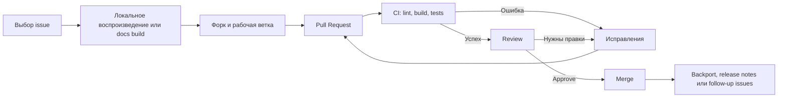

# Аналитический отчёт по быстрым контрибьюшенам в ROS, PX4 и ArduPilot

## Исполнительное резюме

Снимок ниже отражает состояние репозиториев и открытых задач на **1 мая 2026 года**. Исходные пользовательские параметры я трактую так: **уровень опыта — неопределённый**, **язык программирования — не указано**, **ОС — не указана**. При таком вводе самый рациональный подход — не искать «универсальный лучший проект», а искать **самый короткий путь до принятого PR** в каждом ecosystem и затем сравнить стоимость входа, требования к локальному окружению и вероятность быстрого review. citeturn19search0turn30view1turn33search0turn39search0

Если цель — получить **3–5 быстрых PR с высоким шансом мержа**, то картина сейчас довольно чёткая. **ArduPilot** даёт лучший официальный newcomer funnel: на странице contribute прямо сейчас перечислено много открытых **good first issue**. **ROS2** тоже подходит для быстрых вкладов, но наиболее низкий порог входа сосредоточен не в ABI-чувствительном core, а в `ros2_documentation`, `ros2cli`, `launch` и инфраструктурных репозиториях вроде `rosindex`. **PX4** остаётся очень активным проектом, но в core-репозитории на момент просмотра **нет открытых “good first issue”**; следовательно, быстрые входы там лежат главным образом в **docs / metadata / CI / tooling**, а не в полётной логике. citeturn19search0turn4view0turn26view0turn27view0turn11view0turn37view0turn38view0

Поэтому практический рейтинг для первого цикла контрибьюций выглядит так: **ArduPilot → ROS2 → PX4 → ROS1**. Для **ROS1** ситуация принципиально иная: **ROS Noetic официально достиг EOL 31 мая 2025 года**, а ключевой `ros_comm` переведён в read-only archive; это означает, что официальный вклад в **core ROS1** теперь стратегически слаб и почти всегда уступает по отдаче работе с ROS2, `rosdistro`, миграционной документацией и инфраструктурой индексации. citeturn0search0turn2search15turn28search0

Ещё один важный вывод: если не указана ОС, то разумнее всего начинать не с тяжёлых локальных сборок firmware/runtime, а с тех поверхностей проекта, где есть **короткий и проверяемый feedback loop**. Для ROS2 это документация и CLI-тесты; для PX4 — документация, parameter metadata и CI-автоматизация; для ArduPilot — wiki, Lua/Python-инфраструктура, SITL/autotest и помеченные `good first issue`. Это не компромисс «вместо настоящего вклада», а типичная траектория, которую подтверждают недавние слитые PR: простые и полезные изменения чаще всего касаются именно документации, тестов, параметров, мелких refactor и инфраструктурных скриптов. citeturn25view0turn24view0turn36view0

## Состояние проектов и активные репозитории

| Проект | Состояние сейчас | Где реально активность | Практический вывод |
|---|---|---|---|
| ROS1 | Noetic официально завершён; `ros_comm` архивирован и переведён в read-only. | `ros/rosdistro` остаётся активным metadata-репозиторием для релизных описаний и `rosdep`; core ROS1 — уже не главный вектор. | Для первого быстрого вклада **нецелесообразно** идти в core ROS1; разумнее выбирать metadata, migration-notes и смежную инфраструктуру. citeturn0search0turn2search15turn28search0turn28search16 |
| ROS2 | Активный основной вектор ROS; developer guide живой, PR-процесс формализован. Документация указывает на Rolling как development-ветку и на Kilted как latest released version в соответствующих release pages. | `ros2/ros2_documentation`, `ros2/ros2cli`, `ros2/launch`, `ros2/rclpy`, `ros2/rclcpp`, `ros/rosdistro`, `ros-infrastructure/rosindex`. | Быстрые PR есть, но они **сконцентрированы в docs/CLI/infrastructure**, а не равномерно по всему core. citeturn31search3turn31search4turn30view1turn28search1turn28search2turn28search3turn28search0turn27view1 |
| PX4 | Очень активный проект; документация `main` явно отмечена как development version. Проект размещён у entity["organization","Dronecode Foundation","drone autonomy foundation"], которая является collaborative project у entity["organization","Linux Foundation","open source nonprofit"]. | `PX4/PX4-Autopilot`, `PX4/px4_msgs`, `PX4/px4_ros_com`, `PX4/PX4-containers`. | Core активен, но newcomer labels почти отсутствуют; для быстрого входа лучше выбирать docs, tooling, labels, parameter/docs sync, bridge-related tasks. citeturn32search5turn33search14turn34search0turn34search1turn34search2turn11view0 |
| ArduPilot | Активный volunteer-driven проект с очень сильным официальным newcomer funnel. | `ArduPilot/ardupilot` и `ArduPilot/ardupilot_wiki` явно активны; в core много good-first задач, а wiki показывает постоянный поток слитых простых PR. | Лучший вариант для быстрого портфеля из 3–5 PR, особенно если хочется быстро пройти полный цикл issue → fix → review → merge. citeturn20search0turn19search0turn36view0 |

Практически это означает следующее. **ROS2** — лучший баланс между «резюме-ценностью» и доступностью задач, если сознательно начинать с documentation/CLI/test-surface. **PX4** — лучший проект для тех, кто уже готов работать через SITL, логи, конфигурации и parameter semantics, но худший из трёх для «первого PR вообще», потому что официальный GitHub-funnel для новичка сейчас слабее. **ArduPilot** — самый короткий путь до реальных merged contributions. **ROS1** имеет смысл только при конкретной прикладной мотивации: поддержка legacy deployment, миграционные заметки или `rosdistro`-операции. citeturn19search0turn26view0turn37view0turn11view0turn0search0

## Где востребованы вклады прямо сейчас

| Проект | Категории, где спрос очевиден | Почему это востребовано | Что брать первым |
|---|---|---|---|
| ROS1 | metadata, release/packaging, bug reports c воспроизводимостью, migration docs | После EOL core-fixes в официальном ROS1 сужены, но инфраструктурные и metadata-потоки ещё живут. | `rosdistro`, migration notes, index/docs-related правки. citeturn0search0turn2search15turn28search0 |
| ROS2 | документация, tutorials, broken links, CLI tests, launch behavior, rosindex rendering, bug reports с полным environment matrix | Developer Guide жёстко требует CI, DCO, review и documentation updates; одновременно в docs/cli/index есть открытые `good first issue`/`help wanted`. | `ros2_documentation`, `ros2cli`, затем `launch`, потом `rosindex`. citeturn30view1turn4view0turn26view0turn27view0turn6view0 |
| PX4 | docs, parameter reference sync, CI/labels automation, simulator-based repro, small tooling fixes, ROS2 bridge ecosystem | В contribute view нет newcomer-ready issues, а открытые низкорисковые задачи сосредоточены в `scope:docs` и `kind:chore`; CI и docs formalized на уровне проекта. | docs bug, parameter/docs consistency, CI label automation, bridge docs/examples. citeturn11view0turn37view0turn38view0turn33search0turn33search3 |
| ArduPilot | good first issues в core, autotest, SITL, Lua, Python tools, DDS/ROS, wiki/docs | Официальная contribute-page сама служит curated backlog’ом для новичков; руководство по PR просит testing evidence и SITL/real-vehicle validation. | `good first issue` из core + wiki/doc PR как параллельный быстрый канал. citeturn19search0turn39search0turn36view0 |

Здесь особенно важен не только **тип задачи**, но и **режим проверки гипотезы**. Быстрый PR почти всегда требует, чтобы автор мог за несколько минут или часов доказать одно из трёх: **текст/пример исправлен**, **тест теперь ловит проблему**, **поведение воспроизводится и закрывается локально**. У ROS2 и ArduPilot это очень хорошо реализуется через docs, CLI и SITL; у PX4 — через docs, parameter metadata и симуляцию. Глубокие изменения в scheduler, middleware, estimator или flight-control лучше оставлять либо на второй цикл, либо на трек для опытного контрибьютора. citeturn30view1turn32search4turn21search0turn33search15

## Конкретные открытые задачи для быстрого контрибьюта

Для **ROS1 core** я сознательно **не заполняю строки по issue**: на момент просмотра официальный funnel быстрых задач в core фактически отсутствует, что согласуется с EOL Noetic и архивацией `ros_comm`. Для ROS1 практически полезнее смотреть в `rosdistro` и migration/infrastructure work, а не в core runtime. citeturn0search0turn2search15turn28search0

Ниже — curated snapshot открытых задач. Колонки **«Сложность»** и **«Навыки»** — моя оценка, а не официальная метка.

| Проект | Репозиторий | issue# | Заголовок | Метки | Сложность | Предполагаемые навыки | Ссылка |
|---|---|---:|---|---|---|---|---|
| ROS2 | `ros2/ros2_documentation` | #5457 | Document subordinate nodes aka sub-nodes | `good first issue`, `help wanted` | низкая | reStructuredText, Sphinx, базовое понимание nodes | GitHub citeturn4view0 |
| ROS2 | `ros2/ros2_documentation` | #4924 | Add a tutorial on Lifecycle nodes | `good first issue`, `help wanted` | низкая–средняя | docs writing, примеры lifecycle | GitHub citeturn4view0 |
| ROS2 | `ros2/ros2_documentation` | #4209 | make linkcheck finds many broken links | `good first issue`, `help wanted` | низкая | linkcheck, docs hygiene, Sphinx | GitHub citeturn4view0 |
| ROS2 | `ros2/ros2cli` | #1173 | add unit tests for sub-command tab completer | `enhancement`, `good first issue`, `help wanted` | низкая–средняя | Python, pytest, CLI tests | GitHub citeturn26view0 |
| ROS2 | `ros2/ros2cli` | #739 | Add support for `ament_cmake_python` in `ros2 pkg create` | `good first issue`, `help wanted` | средняя | Python, package templates, ament | GitHub citeturn26view0 |
| ROS2 | `ros2/launch` | #931 | YAML: group should also accept a key `actions:` like the Python API | `enhancement`, `good first issue`, `help wanted` | средняя | Python, launch semantics, tests | GitHub citeturn6view0 |
| ROS2 | `ros-infrastructure/rosindex` | #621 | Capture dependency types in the index rendering | `enhancement`, `help wanted` | средняя | web/frontend templating, package metadata | GitHub citeturn27view1 |
| ROS2 | `ros-infrastructure/rosindex` | #632 | Embed Structured Data content for each package and repo | `enhancement`, `help wanted` | средняя | structured data / SEO, templates | GitHub citeturn27view1 |
| PX4 | `PX4/PX4-Autopilot` | #27235 | docs(bug): FW land mode may omit mission mode landing behaviour | `scope:docs` | низкая | docs, fixed-wing semantics, validation by reading code/docs | GitHub citeturn37view0 |
| PX4 | `PX4/PX4-Autopilot` | #26712 | docs(offboard): clarify that DDS setpoints are not gated by offboard mode | `scope:docs` | низкая–средняя | PX4 offboard, ROS2/DDS docs | GitHub citeturn37view0 |
| PX4 | `PX4/PX4-Autopilot` | #24857 | [Docs] [Bug] Radio Control docs don't reflect new architecture | `scope:docs` | средняя | RC architecture, docs, parameter reading | GitHub citeturn17search2 |
| PX4 | `PX4/PX4-Autopilot` | #26065 | [Docs] [Bug] NXP Pixhawk 6XRT Missing CAN3 | `Documentation` | низкая | board docs, CAN wiring clarification | GitHub citeturn16search1 |
| PX4 | `PX4/PX4-Autopilot` | #27188 | More use of the new labeling system | `kind:chore`, `priority:2` | средняя | GitHub automation, triage, labeling rules | GitHub citeturn38view0 |
| PX4 | `PX4/PX4-Autopilot` | #26406 | Board support review - copilot instructions | не указано | средняя | review process, docs/instructions, board support workflow | GitHub citeturn16search10 |
| ArduPilot | `ArduPilot/ardupilot` | #32799 | copter-circle-speed.lua script appears to not work | `good first issue` | низкая–средняя | Lua scripting, SITL repro | GitHub citeturn19search0 |
| ArduPilot | `ArduPilot/ardupilot` | #32792 | AP_DAL_Standalone is broken | `good first issue` | средняя | C++, standalone tooling, build troubleshooting | GitHub citeturn19search0 |
| ArduPilot | `ArduPilot/ardupilot` | #32720 | Explain strange canonical vehicle altitude | `good first issue` | низкая–средняя | docs + system understanding, telemetry semantics | GitHub citeturn19search0 |
| ArduPilot | `ArduPilot/ardupilot` | #32533 | test suite is keeping old filehandles around | `good first issue` | средняя | Python, test infrastructure, resource cleanup | GitHub citeturn19search0 |
| ArduPilot | `ArduPilot/ardupilot` | #32090 | Sub: add an external pressure failsafe | `Safety`, `Sub`, `good first issue` | средняя | C++, failsafe logic, Sub domain | GitHub citeturn19search0 |
| ArduPilot | `ArduPilot/ardupilot` | #31748 | TemperatureSensor: Add Rangefinder to the TEMPx_SRC sensor source options | `Rover`, `Sub`, `good first issue`, `FeatureRequest` | средняя | sensor plumbing, enums/options | GitHub citeturn19search0 |
| ArduPilot | `ArduPilot/ardupilot` | #31588 | Add support for OPTICAL_FLOW_RAD | `good first issue` | средняя | MAVLink/message plumbing, optical flow | GitHub citeturn19search0 |
| ArduPilot | `ArduPilot/ardupilot` | #23478 | AP_DDS: Support IMU+gyro+accel data for rate control or offboard fusion | `EKF`, `ROS`, `good first issue` | средняя–высокая | DDS/ROS, estimator data path, IMU semantics | GitHub citeturn19search4 |

Из таблицы видно важное различие. У **ROS2** и **ArduPilot** быстрые задачи прямо маркируются и официально подаются как newcomer-friendly backlog. У **PX4** такой воронки сейчас почти нет: GitHub contribute page прямо сообщает, что repo не имеет `good first issues`, а filtered queries по `good first issue` и `help wanted` не дают полезного newcomer backlog. Следовательно, для PX4 «быстрый вклад» сегодня — это скорее **осознанно выбранный low-risk docs/tooling workstream**, а не labels-driven funnel. citeturn11view0turn9view0turn10view0turn37view0turn38view0

## Требования к PR, кодстайлу, CI, лицензии и review

| Проект | Лицензия | Что требуется до PR | Кодстайл и проверки | Review / merge |
|---|---|---|---|---|
| ROS1 / ROS2 | **Не едина для всей экосистемы**: нужно проверять конкретный repo; примеры из найденных official repos — `rosdistro` под BSD-3-Clause, `launch` под Apache-2.0. Для ROS2 core действует DCO на PR в ROS Core repos. | Все изменения через PR; для ROS2 core требуется `Signed-off-by` в commit message, CI для tier-1 platforms, документационные изменения должны идти до мержа вместе с кодом. | ROS2 Developer Guide требует стандартные linters из `ament_lint_common`; docs repo отдельно подчёркивает, что лентер не пропускает trailing whitespace. | В ROS2 core нужен минимум один approval от разработчика, не являющегося автором; maintainer guide дополнительно проверяет clean CI, tests, docs и target branch. Для ROS1 core de facto путь обзора почти закрыт из-за архивации. citeturn28search0turn28search3turn30view1turn29search5turn30view2turn0search0turn2search15 |
| PX4 | BSD-3-Clause. | Официальный flow: fork → branch → commits → PR; найденные docs говорят, что изменения будут merged, когда проходят CI. | PX4 использует Google C++ style с минимальными модификациями; для отступов используются tabs, для alignment — spaces. Проект использует GitHub Actions; в testing stack входят unit, integration и fuzz tests. | Branching model формализован как `main / beta / stable`. Формальный минимум approvals в найденных docs **не указан**; из surfaced docs очевидны PR+CI как обязательный минимум. citeturn32search2turn32search13turn8search1turn33search0turn32search7turn32search4turn32search1 |
| ArduPilot | GPLv3. | PR в `master`; отдельная branch в fork; коммиты должны быть маленькими, subsystem-scoped, с subject формата `Subsystem: brief description`; желательно приложить evidence of testing. | Стиль строго формализован: `astyle`, 4 spaces, no tabs; code may be rejected if style not followed. До PR project просит по возможности build_all и SITL/real-vehicle validation. | Core developers review and merge; PR быстрее проходит, если есть testing evidence, style compliance, green CI и обсуждение при необходимости на dev calls. Официальный CONTRIBUTING советует также сначала проверять связанные существующие PR. citeturn20search0turn39search0turn20search1turn20search2turn21search0 |

С точки зрения риска для первого PR это даёт очень разные профили. **ROS2** хорошо формализован, но за формализацию приходится платить: DCO, CI и review expectations выше, чем у «чисто docs» open-source проектов. **PX4** силён по engineering discipline, но его safe newcomer surface сейчас уже, чем кажется по масштабу проекта. **ArduPilot** дружелюбен именно тем, что formal expectations там высокие, но funnel прозрачен: бери good-first issue, покажи testing evidence, обсуждай на dev-call/Discord при необходимости, и pipeline становится предсказуемым. citeturn30view1turn33search0turn19search0turn39search0

## Приоритетные области для новичка и для опытного контрибьютора

Для **новичка** приоритеты я бы расставил так. В **ROS1** — почти ничего из core; только `rosdistro`, index/migration и очень локальные инфраструктурные правки. В **ROS2** — docs, broken links, tutorials, CLI-tests, простые launch/index changes. В **PX4** — docs и metadata/labeling, затем small tooling fixes и симуляционные repro cases. В **ArduPilot** — good-first issues из Lua/Python/autotest/SITL и wiki PR параллельно. Это напрямую следует из текущего распределения открытых labels и из характера недавних простых merged PR. citeturn0search0turn4view0turn26view0turn37view0turn19search0turn36view0

Для **опытного контрибьютора** profile другой. В **ROS2** уже можно идти в `rclpy`, `launch`, platform support и CI; developer guide и maintainer guide прямо задают планку по testing, coverage и review. В **PX4** опытного автора имеет смысл направлять в `commander`, `navigator`, `EKF2`, drivers, middleware (`px4_msgs`, DDS/ROS2 bridge), а также в CI/infrastructure. В **ArduPilot** опытный вклад лучше всего конвертируется в DDS/ROS, EKF, failsafe logic, sensor backends, safety-critical subsystems и autotest expansion. citeturn30view1turn29search5turn33search16turn24view0turn19search4turn39search0

Если цель — **максимум merged PR на минимальном времени**, то новичку я бы дал одну из двух стратегий. Первая, «портфельная»: **2 PR в ROS2 + 1 PR в PX4 + 2 PR в ArduPilot**. Вторая, «серийная»: **4–5 PR подряд в ArduPilot**, затем один PR в ROS2 ради диверсификации стека. Первая стратегия сильнее для CV и network effects; вторая почти всегда быстрее. citeturn19search0turn25view0turn36view0turn11view0

## Пример пошагового плана на 3–5 быстрых PR

Ниже — реалистичный план для автора с неопределённым уровнем опыта и неуказанной ОС. Я сознательно строю его так, чтобы первые шаги не требовали сложной аппаратной части и больших локальных билдов firmware.

| Шаг | Действие | Цель | Оценка времени |
|---|---|---|---|
| Первый PR | Взять ROS2 docs issue из `ros2_documentation` — лучше всего #4209, #5457 или #4924. | Быстро пройти весь цикл docs build → PR → review в зрелом проекте. | 2–6 часов |
| Второй PR | Взять ROS2 `ros2cli` issue #1173. | Добавить тесты и показать умение работать с Python/CLI и repo-level CI. | 4–10 часов |
| Третий PR | В PX4 взять #27235 или #26712. | Войти в PX4 без риска трогать flight-critical code; научиться работать с docs-in-repo model. | 3–8 часов |
| Четвёртый PR | В ArduPilot либо взять wiki-правку, либо core good-first issue #32720 / #32533. | Получить быстрый merge в проекте с сильным newcomer funnel. | 4–12 часов |
| Пятый PR | В ArduPilot взять второй core good-first issue — #32799, #31748 или #31588 — либо сделать ещё один wiki/doc PR. | Закрепить серию и выйти на 3–5 merged PR за короткий цикл. | 6–16 часов |

Под этот план есть хорошее эмпирическое основание. В ROS2 recent simple merges идут именно через docs/tutorials/release-note updates; в PX4 — через docs/parameter/infrastructure fixes; в ArduPilot wiki merges идут почти непрерывно, а core good-first issues curated официально. Иными словами, этот план следует не абстрактной теории, а наблюдаемым паттернам уже принятых изменений. citeturn25view0turn24view0turn36view0turn19search0

Практически я бы делал так. **День первый**: поднять ROS2 docs environment и отправить один docs PR. **День второй**: взять один CLI test PR в ROS2. **День третий**: перейти в PX4 docs issue и закрыть его на чтении кода и docs. **День четвёртый–пятый**: переключиться на ArduPilot wiki или простой good-first из core. Такой режим хорош тем, что он даёт разнообразие стеков, но не заставляет с первого дня проваливаться в hardware-in-the-loop, нестабильные toolchains или сложную flight semantics. citeturn30view2turn33search1turn21search0

## Подготовка окружения, тестов и рабочего процесса

Если ОС **не указана**, наиболее безопасная стратегия — стартовать с тех официальных путей, которые либо прямо поддерживают контейнеры, либо минимизируют системную зависимость. У ROS2 docs repo есть **Codespaces** и **Devcontainer**. PX4 официально рекомендует контейнерный путь и отдельно документирует `px4-dev`/`docker_run.sh`, а также WSL2-based setup на Windows. ArduPilot даёт сильную ставку на **SITL**, который позволяет проверять поведение без hardware. citeturn30view2turn33search1turn33search6turn21search0

Для **ROS2** самый короткий официальный путь — начать с документации. Документационный репозиторий поддерживает Devcontainer и Codespaces; для локальной сборки достаточно `make html`, а docs linter не примет trailing whitespace. Это делает `ros2_documentation` лучшей первой площадкой, если вы не хотите сразу собирать весь ROS2 source tree. citeturn30view2turn29search18

```bash
git clone https://github.com/ros2/ros2_documentation
cd ros2_documentation
make html
```

Для **PX4** короткий и воспроизводимый маршрут — контейнеры и SITL. Официальные docs рекомендуют helper script `docker_run.sh`, отдельный `px4-dev` container, `make tests` для unit tests и ASAN-режим для симуляции. Для end-to-end behavior рекомендуемый integration framework — MAVSDK-based tests. citeturn33search1turn33search2turn33search17turn32search0

```bash
./Tools/docker_run.sh 'make px4_sitl_default'
make tests
PX4_ASAN=1 make px4_sitl jmavsim
```

Для **ArduPilot** основной принцип — сначала освоить **SITL**, а затем уже лезть в более дорогие по времени тестовые контуры. Официальные dev docs описывают build path через `waf`, а SITL documentation подчёркивает, что симулятор позволяет работать без специального hardware. В дополнительных official materials ArduPilot прямо показывает примеры `waf configure`, `waf <vehicle>` и рекомендует `sim_vehicle.py`, который сворачивает configure/build/launch в один поток для simulation work. citeturn20search2turn21search0turn40search2turn39search0

```bash
./waf configure --board=CubeBlack
./waf plane
./waf plane --upload

# Для симуляции используйте sim_vehicle.py,
# который оборачивает configure/build/launch в одном workflow.
```

Ниже — синтетическая схема рабочего цикла, которая в целом совпадает с официальными процессами ROS2, PX4 и ArduPilot, хотя конкретные требования на уровне approvals, DCO и testing evidence различаются между проектами. citeturn30view1turn33search0turn39search0



Компактный набор официальных ресурсов, на которые стоит опираться в первую очередь, выглядит так:

| Проект | Contributing guide | Build / test docs | Сообщество / review notes |
|---|---|---|---|
| ROS2 | Developer Guide; Contributing to ROS 2 Documentation. citeturn30view1turn30view2 | Code-style/linters через `ament_lint_common`; docs build через `make html`. citeturn30view1turn29search18turn30view2 | DCO, tier-1 CI, минимум один approval для ROS2 core. citeturn30view1turn29search5 |
| PX4 | Source Code Management / contribute pages. citeturn32search13turn8search11 | CI, Docker, unit tests, MAVSDK integration tests. citeturn33search0turn33search1turn33search2turn32search0 | На docs homepage явно выведены Discuss и entity["company","Discord","chat platform"]; формальный минимум approvals в просмотренных источниках не указан. citeturn33search14turn32search13 |
| ArduPilot | CONTRIBUTING.md; Submitting Patches Back to Master; Style Guide. citeturn20search0turn39search0turn20search1 | Building the code; SITL Simulator. citeturn20search2turn21search0 | New developers are directed to Discord; доступны также Discourse и entity["company","Gitter","developer chat service"]. PR быстрее идёт при наличии testing evidence и green CI. citeturn20search0turn39search0 |

## Недавние простые PR и что они показывают

Для **ROS1 core** я не нашёл сопоставимого набора **недавних простых merged PR** в официальном core, что полностью согласуется с EOL и архивацией `ros_comm`. Это само по себе важный аналитический сигнал: в ROS1 сегодня слаб не только backlog задач, но и сам поток low-friction merges в официальном core. citeturn0search0turn2search15

Ниже — 15 недавних простых PR, которые хорошо иллюстрируют, где на самом деле лежат быстрые входы.

| Проект | PR# | Что изменено | Почему это хороший ориентир для первого вклада |
|---|---:|---|---|
| ROS2 | #6502 | update documentation on the EventsCBGExecutor | Точечная документационная правка в актуальной теме executor’ов. citeturn25view0 |
| ROS2 | #6508 | Update installation instructions to Lyrical Tier 1 platforms | Обновление installation docs под текущую платформенную матрицу. citeturn25view0 |
| ROS2 | #6485 | Update project URL for Czech Technical University | Малый housekeeping PR с очень низким review risk. citeturn25view0 |
| ROS2 | #6476 | Add RViz Marker tutorials | Пример «значимого, но доступного» tutorial PR. citeturn25view0 |
| ROS2 | #6460 | Added a tutorial for writing an AsyncNode in rclpy | Хороший пример добавления tutorial-level content без вторжения в ABI-sensitive core. citeturn25view0 |
| PX4 | #27256 | docs(docs): Orbit status msg updates | Малый docs PR, завязанный на message semantics. citeturn24view0 |
| PX4 | #27207 | Fix typo in Python package name in user guide | Почти идеальный first PR: маленький, полезный, объективно проверяемый. citeturn24view0 |
| PX4 | #27249 | docs(update): Add OEM section | Документационный PR умеренного объёма без риска для flight stack. citeturn24view0 |
| PX4 | #27211 | docs(params): Fix up params that render badly after prettier | Отличный пример parameter/docs sync work. citeturn24view0 |
| PX4 | #27183 | docs(infrastructure): Update dependencies | Пример инфраструктурной housekeeping-работы, которая реально нужна проекту. citeturn24view0 |
| ArduPilot | #7720 | add sitl uart flow control wiki | Быстрая, полезная wiki-правка по developer-facing теме. citeturn36view0 |
| ArduPilot | #7722 | Clarify Sport mode parameter references | Типичный low-risk doc clarification PR. citeturn36view0 |
| ArduPilot | #7715 | Copter: AutoTrim - Correct new images directory | Мелкая, но полезная doc/images fix. citeturn36view0 |
| ArduPilot | #7711 | Images: Update RC calib images | Чистая docs/media surface с быстрым feedback loop. citeturn36view0 |
| ArduPilot | #7704 | Update Drift Mode documentation | Ещё один пример того, что wiki contributions в ArduPilot сейчас реально и быстро мержатся. citeturn36view0 |

Общий паттерн у этих PR очень показателен. **Быстрые mergers не начинаются с heroics в scheduler, EKF или middleware internals**. Они начинаются с документации, tutorial-quality improvements, parameter semantics, тестовой инфраструктуры, мелких refactor и housekeeping. Поэтому для человека с **неопределённым уровнем опыта** наиболее рационально строить вход не вокруг «самой амбициозной» задачи, а вокруг **самой дешёвой по верификации**. На текущем snapshot это особенно верно для PX4 и ROS2; в ArduPilot к этому добавляется ещё и официальный backlog `good first issue`, что делает проект лучшим стартом для серии быстрых и честных контрибьюшенов. citeturn24view0turn25view0turn19search0turn36view0
